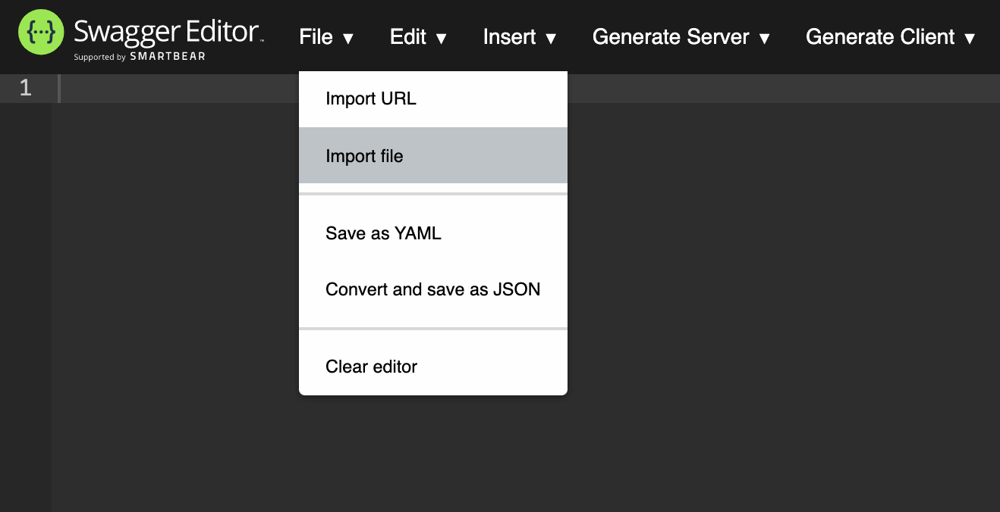

# Dandelion documentation

This is the main documentation folder for the system design. The sections below
provide some notes on how to use it.

## ER diagram

The ER diagram is produced using [diagrams.net](https://www.diagrams.net/).
It can be viewed and edited either with the online version or the desktop app.
To load the diagram, just follow the instructions when the app starts. Changes
are automatically saved as you go along.

For notes on ER diagram style, please see the notes [here](https://bdavison.napier.ac.uk/db/Practicals/Drawio/erd/)
which also cover the general use of the diagrams.net tool.

## API spec

The API spec is produced using the [Swagger editor](https://editor.swagger.io).
To load the data, open the tool and choose *Import file* from the *File* menu
as shown below.

