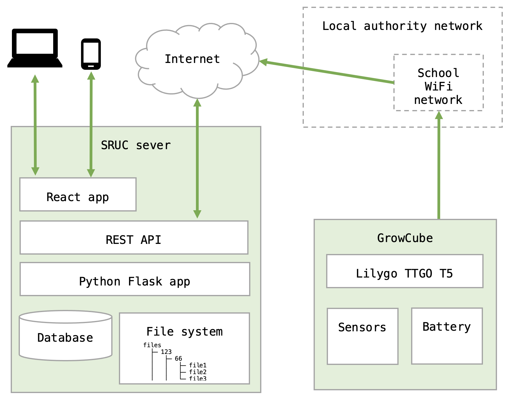

# Dandelion

### Data collection and visualisation platform for schools

The Dandelion project will involve around 500 schools across Scotland in activities related to the cultivation of plants. 100 participating secondary schools will be supplied with Liberty Produce GrowCubes for the purposes of conducting experiments on the effects of various factors on plant growth. The schools project will run throughout 2022, but the majority of activity will take place during the growing season between April and September.

This repo is for a web-based technical solution which supports

* The publication of textual and visual content
* The management of novel projects based on the Liberty Produce GrowCubes
* Managed access to the various categories of data by appropriate users and systems

The top-level directories in the source correspond to the three main elements of the system:

* **Flask**: back-end Flask application that implements the REST API and manages access to data
* **React**: front-end React application that provides the user interface for all users
* **Node**: firmware for the IoT node installed in the GrowCubes

# Installation

The back-end (Flask) and front-end (React) apps need to be installed separately.

See the README files in the relevant sections.

In overview, the installation process is

* Deploy bare-bones Unbuntu server 
* Create DNS entry
* [Install Nginx](https://www.digitalocean.com/community/tutorials/how-to-install-nginx-on-ubuntu-20-04) 
* [Install security certificate](https://certbot.eff.org/instructions?ws=nginx&os=ubuntufocal)
* Configure for https traffic only
* [Install MariaDB](https://www.digitalocean.com/community/tutorials/how-to-install-mariadb-on-ubuntu-20-04)
* Create Dandelion database
* [Install Anaconda Python](https://docs.anaconda.com/anaconda/install/linux/)
* Deploy application code
* Configure virtual environment (use dandelion.yml)
* [Setup database migrations]()
* Initialise the database
* Install node.js
* Install required node packages

# Licence

