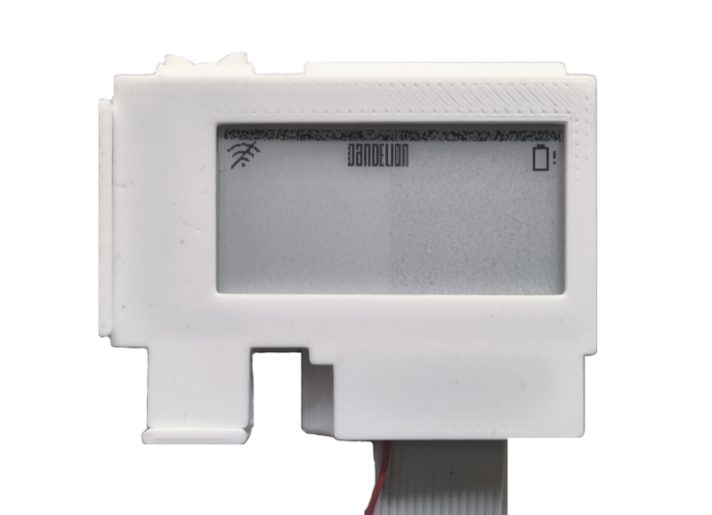

# Dandelion IoT node reference

### Welcome to the user guide for your IoT node.

These pages cover the important things you need to know about setting up
and using your Dandelion IoT node. As new questions arise, the content will be
updated to address your needs. If you would like to request an addition or
amendment to these pages, please contact 
Brian Davison [b.davison@napier.ac.uk](mailto:b.davison@napier.ac.uk)

## What's a *node*?

*Node* is the term generally used to refer to one device connected to a shared 
network. In the Internet of Things (IoT), the aim is to connect many (potentially
all) real-world objects to the Internet so that they can exchange information.
In that scenario, everything becomes a node. 

Your IoT node is based on a microprocessor called a LilyGo T5 which is essentially
a small computer. Unlike your laptop, it does not have an operating system like
Windows, MacOS or Linux. Instead, it has only a single program called *firmware*
with a specific purpose which runs continuously. Its job is to take readings from 
the attached sensors and send the information back to the Dandelion app over the 
Internet. It does this by connecting to an available wifi access point.

## Getting started

There are three things you need to do to get your node up and running:

1. [Install](install.md) it in your GrowCube
2. [Configure](config.md) it to connect to your local wifi network
3. [Register](register.md) your node using the Dandelion app so that it is associated with your school

## Overview of operation

The node has two modes, one for configuring its settings and another for normal
operations. In the latter mode, the node goes through the following cycle

1. Read the sensors
2. Connect to wifi
3. Transfer the sensor data to the Dandelion app
4. Disconnect from wifi
5. Sleep for an hour and then repeat

Sensor reading are therefore taken hourly. The node sleeps between readings to
conserve battery power.

##  Display

The node incorporates an e-paper display. Instead of using a backlight to 
create an image, this type of display controls black and white particles to
create an image that relies on reflected light just like a printed image.

Because power is only required to change the image and not to maintain it, this
type of display is very power efficient. However it is important to remember
that the image on the screen is the one created the last time it was refreshed.
For example, if the battery runs out an image will still be displayed.

E-paper displays can be subject to 'ghost' images and other random effects. If
you notice any strange marks on the image, please ignore them. They should have
no effect on the operation of the node.
